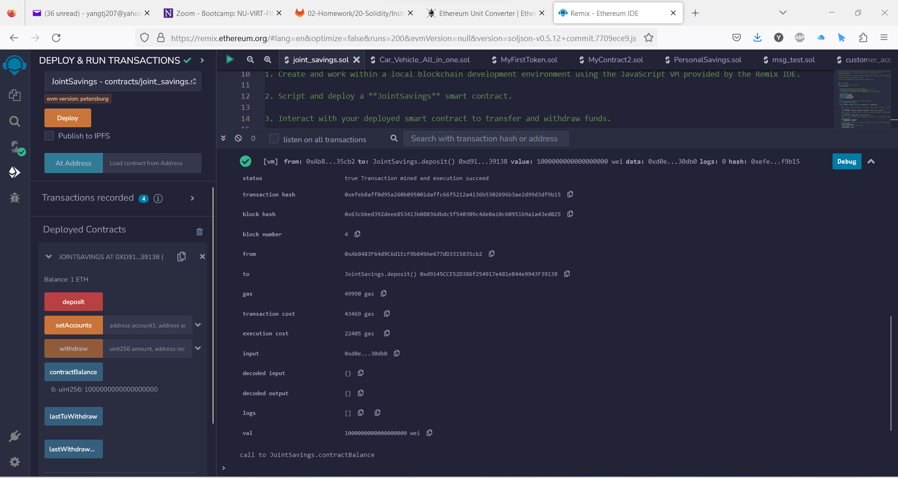

# Joint Savings Account

We created a new smart contract named `JointSavings` with two accounts:

* Account1 address: 0xAb8483F64d9C6d1EcF9b849Ae677dD3315835cb2
* Account2 address: 0x4B20993Bc481177ec7E8f571ceCaE8A9e22C02db

We first made some deposits:

* Transaction 1: send 1000000000000000000 Wei (1 Ether)

* Transaction 2: send 10000000000000000000 Wei (10 Ether)

* Transaction 3: send 5 Ether

We then made two withdraws:

* Withdraw 5 Ether into account1

* Withdraw 10 Ether into account2

All the transactions were successful. The solidity file is [joint_savings.sol](joint_savings.sol).